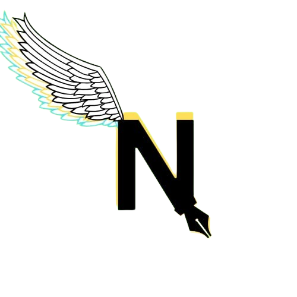

<html lang="en">

<head>
    <meta charset="UTF-8">
    <meta name="viewport" content="width=device-width, initial-scale=1.0">
    <title>Novel North</title>
    
</head>

<body>
    <header>
        

             North 
            

                <button><a href="file:///C:/Users/tisna/OneDrive/Desktop/Website%20lab/Firdaus%20Server(1).html">Home</a></button>
                <button><a href="file:///C:/Users/LENOVO/Desktop/belajar%20code/New%20folder/contact.html">Contact</a></button>
                <button><a href="file:///C:/Users/LENOVO/Desktop/belajar%20code/New%20folder/login.html">Login Yuk</a></button>
                <button><a href="file:///C:/Users/LENOVO/Desktop/belajar%20code/New%20folder/pembelajaran.html">3 Tema Pembelajaran</a></button>
                <button><a href="file:///C:/Users/tisna/OneDrive/Desktop/Website%20lab/link%20belajar.html" style="color: red;">Pembelajaran</a></button>
                
            

        

    </header>

    

        

            <h2>Bab 1 - Kota Lembah Emas</h2>
            
<i>Malam tiba di Kota Lembah Emas. Langit dipenuhi bintang-bintang, sementara gedung-gedung besar berdiri megah menghiasi pemandangan. Namun, ada sesuatu yang terasa ganjil. Setiap bangunan—dari rumah kecil hingga gedung pencakar langit—dilengkapi dengan pengait besar di atapnya. Tidak ada yang tahu pasti tujuan benda itu, dan penduduk kota jarang membicarakannya, seolah-olah itu hanyalah bagian biasa dari kehidupan sehari-hari.  

                 Kota Lembah Emas dikenal sebagai pusat kemakmuran. Dengan tambang emas besar di lembah dan hutan luas di kaki gunung, kota ini memegang kekayaan alam yang melimpah. Mata uangnya, LB, lebih mahal dan kuat dibandingkan kota mana pun, menjadi simbol kejayaan yang membuat daerah ini disegani. Namun, di balik kemewahan dan gemerlapnya, ada misteri yang membuat penduduk selalu waspada: getaran misterius yang datang tanpa peringatan. 
                 Guncangan itu terjadi hampir setiap siang hari. Tidak peduli seberapa kokoh bangunannya, setiap minggu ada saja gedung yang runtuh atau retak. Rumor terus beredar—mulai dari penjelasan logis seperti aktivitas lempeng bumi atau dampak tambang yang terlalu dalam, hingga desas-desus yang jauh lebih gelap. Sebagian orang percaya bahwa getaran itu adalah peringatan dari makhluk kuno yang tinggal jauh di dalam perut bumi, penjaga kekayaan alam Lembah Emas. 
                 Aku sendiri tidak percaya semua itu. Hingga kini, belum ada informasi resmi yang dapat menjelaskan penyebab getaran ini. Ilmuwan tidak pernah datang untuk menyelidiki, atau mungkin mereka sengaja tidak diundang. Tidak ada penelitian, tidak ada jawaban. Anehnya, meskipun misteri ini belum terpecahkan, kota ini tidak pernah kehilangan penduduk. Orang-orang tetap berdatangan, tergoda oleh janji kekayaan yang mengalahkan rasa takut 
                 Namun, semakin lama aku tinggal di sini, semakin aku merasa ada sesuatu yang disembunyikan. Pengait-pengait di atap, gedung-gedung yang dibangun ulang berulang kali, dan sikap penduduk yang tampaknya menghindari topik ini. Kota ini seperti diam-diam menyimpan rahasia besar. 
                 Hingga suatu hari, aku melihat sesuatu yang mengubah semuanya. </i>
            
 
            
 North Arlington  
                29.9.2009 
            

        

        

            <h2>Bab 2 - Misteri yang Belum Terpecahkan</h2>
            
Guncangan terjadi hampir setiap minggu. Rumor tentang makhluk kuno di perut bumi menjadi perbincangan...

        

        

            <h2>Bab 3 - Penemuan Baru</h2>
            
Aku menemukan sesuatu yang mengubah segalanya. Pengait di atap, bangunan yang terus direnovasi...

        

        

            <h2>Bab 4 - Akhir dari Misteri</h2>
            
Pada akhirnya, aku mengetahui kebenarannya. Kota ini menyimpan rahasia besar yang tidak pernah
                terungkap...

        

        

            <button id="prev">⬅️ Sebelumnya</button>
            <button id="next">Berikutnya ➡️</button>
        

    

    

        <button id="zoom-in">➕</button>
        <button id="zoom-out">➖</button>
    

    <button id="scroll-top">⬆️</button>

    
</body>

</html>
